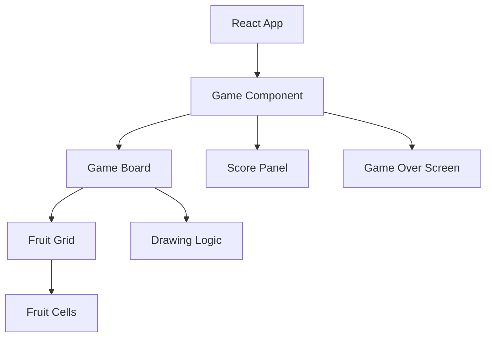

## 1. Architecture Design
纯前端游戏应用，使用 React 构建，无后端需求。

## 2. Technology Description
- Frontend: React@18 + tailwindcss@3 + vite + TypeScript
- Initialization Tool: vite-init
- Backend: None
- Database: None

## 3. Route Definitions
| Route | Purpose |
|-------|---------|
| / | 游戏主页面 |

## 4. API Definitions (if backend exists)
无后端 API

## 5. Server Architecture Diagram (if backend exists)
无后端

## 6. Data Model (if applicable)
无数据库需求
