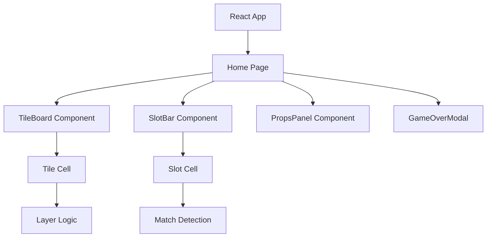

## 1. Architecture Design
纯前端游戏应用，使用 React 构建，无后端需求。

## 2. Technology Description
- Frontend: React@18 + tailwindcss@3 + vite + TypeScript
- State Management: React hooks
- Styling: Tailwind CSS with custom animations

## 3. Route Definitions
| Route | Purpose |
|-------|---------|
| / | 游戏主页面 |

## 4. Data Model

### Tile
- id: string - 唯一标识
- type: TileType - 方块类型(emoji图标)
- layer: number - 所在层(0=底层, 2=顶层)
- row: number - 行位置
- col: number - 列位置
- isCovered: boolean - 是否被上层覆盖
- isRemoved: boolean - 是否被移出到缓存区

### Slot
- id: number - 槽位索引(0-6)
- tile: Tile | null - 槽位中的方块

### Game State
- tiles: Tile[][] - 所有方块(按层组织)
- slots: Slot[] - 底部7个槽位
- removedTiles: Tile[] - 移出缓存区的方块
- score: number - 当前得分
- level: number - 当前关卡
- gameOver: boolean - 游戏是否结束
- victory: boolean - 是否通关
- props: { remove: boolean, undo: boolean, shuffle: boolean } - 道具使用状态
- history: GameStateSnapshot[] - 操作历史(用于撤销)

## 5. Props Mechanics

### 移出 (Remove)
- 将槽位中的前3张牌移动到removedTiles区域
- removedTiles中的牌可以再次点击放回槽位
- 每局限用1次

### 撤销 (Undo)
- 回退到上一步操作
- 恢复槽位和牌堆状态
- 每局限用3次

### 洗牌 (Shuffle)
- 打乱场上所有未消除的方块
- 重新随机分配位置
- 每局限用1次
