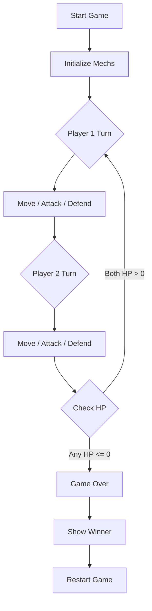

## 1. Product Overview
像素风机甲对战小游戏，两个机甲角色在复古像素风格场景中进行回合制对战，支持移动、攻击、防御操作，包含血量与胜负判定机制。

## 2. Core Features

### 2.1 User Roles
| Role | Registration Method | Core Permissions |
|------|---------------------|------------------|
| Player 1 | Keyboard controls | Control left mech with WASD + J/K |
| Player 2 | Keyboard controls | Control right mech with Arrow keys + 1/2 |

### 2.2 Feature Module
1. **Game Arena**: Battle scene with pixel art background
2. **Mech Characters**: Two pixel-style mechs with animations
3. **Battle System**: Attack, defense, movement mechanics
4. **Health System**: HP bars and damage calculation
5. **Victory Screen**: Winner announcement

### 2.3 Page Details
| Page Name | Module Name | Feature description |
|-----------|-------------|---------------------|
| Game Screen | Arena | Pixel art battle field with grid |
| Game Screen | Mech 1 | Player 1 controlled mech with HP bar |
| Game Screen | Mech 2 | Player 2 controlled mech with HP bar |
| Game Screen | HUD | Health bars, action buttons, turn indicator |
| Victory Screen | Result | Winner display with restart option |

## 3. Core Process

## 4. User Interface Design

### 4.1 Design Style
- **Primary Colors**: Cyan (#00FFFF), Magenta (#FF00FF), Yellow (#FFFF00)
- **Secondary Colors**: Dark Blue (#1a1a3e), Dark Purple (#2d1b4e)
- **Button Style**: Pixel art style, sharp edges, 8-bit aesthetic
- **Font**: Pixel font (Press Start 2P), 8-12px
- **Layout**: Split screen with mechs on left/right, HUD at top/bottom
- **Animation**: Pixel art walking, attacking, and hit animations

### 4.2 Page Design Overview
| Page Name | Module Name | UI Elements |
|-----------|-------------|-------------|
| Game Screen | Arena | Pixel grid background, 8x8 tile size |
| Game Screen | HUD | Top: HP bars with pixel art hearts, Bottom: Action indicators |
| Game Screen | Mechs | 32x48 pixel sprites with 4-frame animations |
| Victory Screen | Result | Large pixel text, winner mech display |

### 4.3 Responsiveness
- Desktop-first, fixed 800x600 canvas
- Center-aligned on all screen sizes
