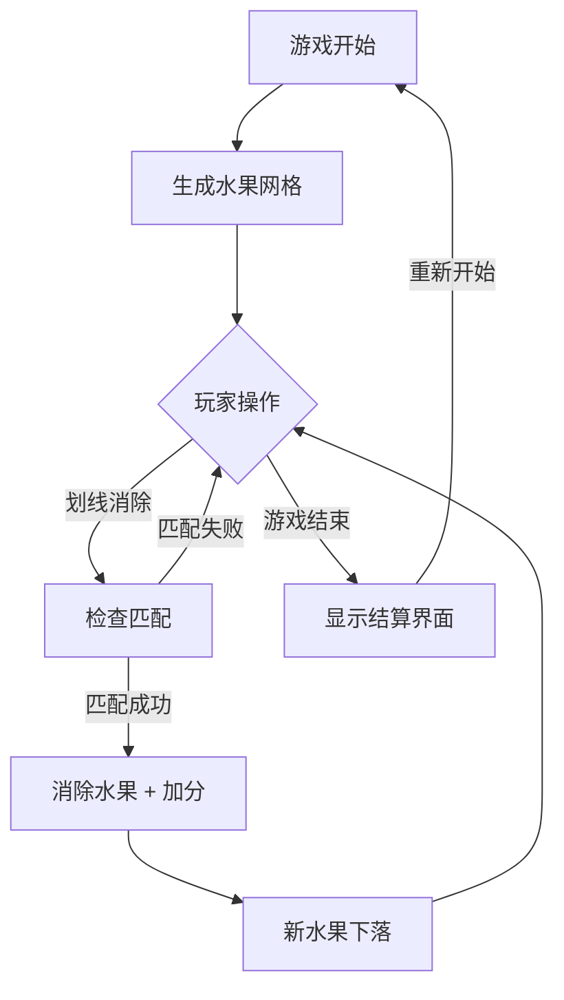

## 1. Product Overview
一款将消消乐和切西瓜结合的休闲小游戏，玩家通过划线消除匹配的水果，体验双重游戏乐趣。
- 目标用户：各年龄段休闲游戏爱好者
- 市场价值：结合两种经典游戏玩法，创新体验，容易上手

## 2. Core Features

### 2.1 User Roles (if applicable)
无需用户角色区分，单玩家游戏

### 2.2 Feature Module
1. **游戏主界面**: 游戏画布、分数显示、水果网格、操作提示
2. **游戏结束界面**: 最终得分、重新开始按钮

### 2.3 Page Details
| Page Name | Module Name | Feature description |
|-----------|-------------|---------------------|
| 游戏主界面 | 游戏画布 | 显示水果网格，支持鼠标/触摸划线消除 |
| 游戏主界面 | 分数系统 | 实时显示当前得分，连击加分 |
| 游戏主界面 | 水果生成 | 随机生成多种水果，自动下落填充 |
| 游戏结束界面 | 结算面板 | 显示最终得分，提供重新开始功能 |

## 3. Core Process
玩家进入游戏 → 水果网格随机生成 → 玩家划线连接3个及以上相同水果 → 水果消除得分 → 新水果下落填充 → 游戏继续直至无法消除或达到时间限制 → 显示结算界面

## 4. User Interface Design
### 4.1 Design Style
- 主色调：绿色系（#4CAF50）代表水果主题，橙色（#FF9800）作为强调色
- 按钮风格：圆角、渐变、微阴影
- 字体：圆润可爱的 sans-serif 字体（Fredoka One 用于标题，Nunito 用于正文）
- 布局风格：卡片式、居中布局
- 图标风格：Emoji 风格的水果图标

### 4.2 Page Design Overview
| Page Name | Module Name | UI Elements |
|-----------|-------------|-------------|
| 游戏主界面 | 游戏画布 | 6x6 水果网格，彩色水果图标，划线动画 |
| 游戏主界面 | 顶部面板 | 分数显示、最高分记录、游戏状态 |
| 游戏主界面 | 背景 | 渐变背景、装饰性水果图案 |
| 游戏结束界面 | 结算面板 | 大字体得分、庆祝动画、重新开始按钮 |

### 4.3 Responsiveness
- 桌面优先设计，支持触摸操作
- 响应式布局，适配不同屏幕尺寸
- 移动端优化触摸区域

### 4.4 3D Scene Guidance (if applicable)
- 无 3D 场景需求
