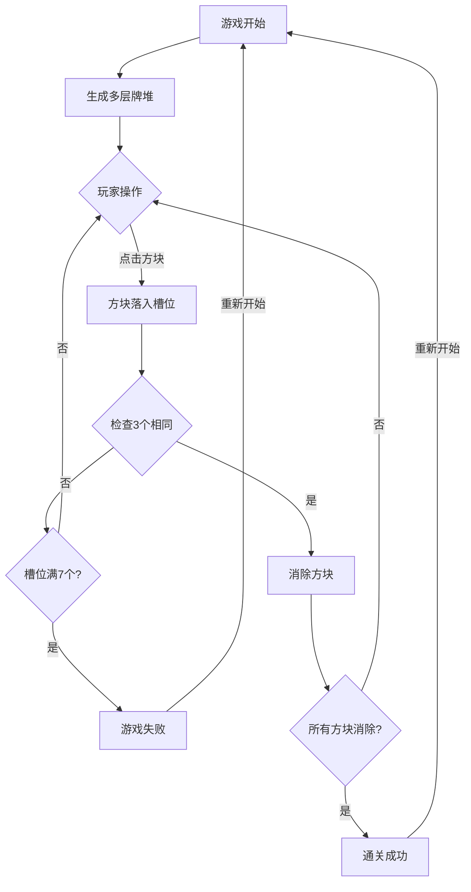

## 1. Product Overview
一款基于"羊了个羊"玩法的多层叠加式三消闯关小游戏。

- 目标用户：各年龄段休闲游戏爱好者
- 市场价值：经典三消玩法结合多层堆叠机制，策略性强

## 2. Core Features

### 2.1 User Roles
无需用户角色区分，单玩家游戏

### 2.2 Feature Module
1. **牌堆系统**: 多层堆叠的方块，必须消除上层才能解锁下层
2. **槽位系统**: 底部7个槽位，凑齐3个相同图案自动消除
3. **道具系统**: 移出(存储3张牌)、撤销(回退一步)、洗牌(打乱所有方块)
4. **游戏状态**: 通关成功/槽位满了游戏失败

### 2.3 Page Details
| Page Name | Module Name | Feature description |
|-----------|-------------|---------------------|
| 游戏主界面 | 牌堆区 | 显示多层堆叠的方块，支持点击 |
| 游戏主界面 | 槽位栏 | 底部7个槽位，显示当前放入的牌 |
| 游戏主界面 | 道具栏 | 3个道具按钮，各有使用次数 |
| 游戏主界面 | 信息面板 | 显示当前关卡、得分 |
| 结算界面 | 结算面板 | 通关/失败提示，重新开始按钮 |

## 3. Core Process

玩家进入游戏 → 牌堆随机生成(多层堆叠) → 玩家点击方块 → 方块落入槽位 → 凑齐3个相同消除 → 检查槽位是否满7个 → 通关或失败

## 4. User Interface Design

### 4.1 Design Style
- 主色调：蓝色渐变(#667eea → #764ba2)代表神秘夜空
- 辅助色：金色(#ffd700)作为强调色
- 按钮风格：圆角卡片、发光效果
- 字体：可爱圆润的字体风格
- 图标风格：多彩emoji风格的方块图标

### 4.2 Page Design Overview
| Page Name | Module Name | UI Elements |
|-----------|-------------|-------------|
| 游戏主界面 | 牌堆区 | 3层堆叠的菱形方块布局，彩色图标 |
| 游戏主界面 | 槽位栏 | 7个圆角槽位，悬停高亮 |
| 游戏主界面 | 道具栏 | 3个道具按钮(移出/撤销/洗牌) |
| 游戏主界面 | 顶部面板 | 关卡显示、分数 |
| 结算界面 | 结算面板 | 通关/失败动画、重新开始按钮 |

### 4.3 Responsiveness
- 移动端优化，支持触摸操作
- 响应式布局，适配不同屏幕尺寸

## 5. Game Rules

### 5.1 Core Mechanics
- **牌堆**: 方块多层堆叠，上层覆盖下层
- **点击**: 点击未被覆盖的方块，使其落入下方槽位
- **消除**: 槽位中有3个相同图案时自动消除
- **胜利**: 消除所有方块
- **失败**: 槽位满7格且无3个相同

### 5.2 Props System
- **移出**: 将前3张槽位牌暂时移出，可再次放入
- **撤销**: 回退到上一步操作
- **洗牌**: 打乱场上所有方块的位置

### 5.3 Tile Types
使用8种不同颜色的emoji图标作为方块类型
