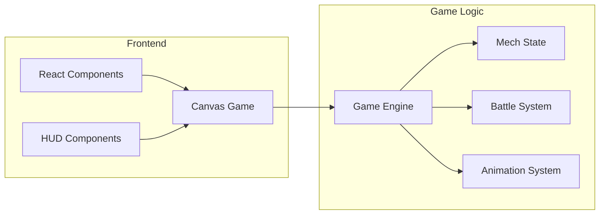

## 1. Architecture Design


## 2. Technology Description
- Frontend: React@18 + TypeScript + Vite
- Styling: TailwindCSS@3
- Game Rendering: HTML5 Canvas API
- State Management: React useState/useReducer
- Font: Press Start 2P (Google Fonts)

## 3. Route Definitions
| Route | Purpose |
|-------|---------|
| / | Main game screen with arena and HUD |

## 4. Component Structure
```
src/
├── components/
│   ├── Game.tsx          # Main game container
│   ├── GameCanvas.tsx    # Canvas rendering component
│   ├── HUD.tsx           # Health bars and UI
│   └── VictoryScreen.tsx # Win/lose overlay
├── hooks/
│   └── useGameLogic.ts   # Game state management
├── utils/
│   ├── gameEngine.ts     # Core game logic
│   ├── constants.ts      # Game constants
│   └── pixelRenderer.ts  # Pixel art rendering helpers
├── types/
│   └── game.ts           # TypeScript types
└── App.tsx               # Root component
```

## 5. Data Model

### 5.1 Mech State
```typescript
interface Mech {
  id: string;
  x: number;
  y: number;
  health: number;
  maxHealth: number;
  isDefending: boolean;
  animationFrame: number;
  animationType: 'idle' | 'walk' | 'attack' | 'defend' | 'hit';
}
```

### 5.2 Game State
```typescript
interface GameState {
  mech1: Mech;
  mech2: Mech;
  currentTurn: 'player1' | 'player2';
  gamePhase: 'playing' | 'victory' | 'gameover';
  winner: 'player1' | 'player2' | null;
  actionLog: string[];
}
```

## 6. Input Controls
| Player | Move Up | Move Down | Move Left | Move Right | Attack | Defend |
|--------|---------|-----------|-----------|------------|--------|--------|
| Player 1 (Left) | W | S | A | D | J | K |
| Player 2 (Right) | ↑ | ↓ | ← | → | 1 | 2 |

## 7. Game Mechanics
- **Movement**: Each mech can move 1 tile per turn (8x8 pixels)
- **Attack**: Deals 15-25 damage based on random factor
- **Defend**: Reduces incoming damage by 50% for 1 turn
- **Range**: Attack range is 2 tiles
- **Turn Order**: Player 1 starts, then alternating
- **Win Condition**: Reduce opponent's HP to 0
